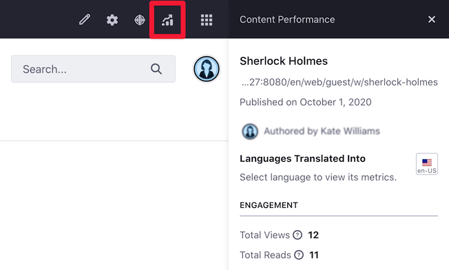
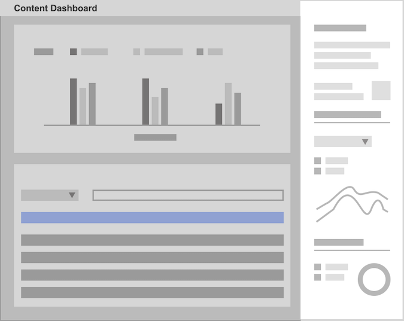

# About the Content Performance Tool

> Available: Liferay 7.3+.

The *Content Performance Tool* is a global application for analyzing performance metrics of your content, like traffic channels or the number of views and reads over time. Using the Content Performance Tool, content teams can periodically assess and adapt the content strategy execution.

To learn how to analyze your content performance quantitatively using the Content Performance Tool, see [Analyze Content Metrics Using the Content Performance](./analyze-content-metrics-using-content-performance-tool.md).

```note::
   For managing and audit your content across Sites and Asset Libraries, use the `Content Dashboard <../content-dashboard/about-the-content-dashboard.md>`_.
```

## Accessing the Content Performance Tool

You can open the Content Performance Tool from [Web Content](#accessing-the-content-performance-tool-from-web-content) or from the [Content Dashboard](#accessing-the-content-performance-tool-from-the-content-dashboard) using the *View Metrics* () option.

You can access the Content Performance Tool when the following conditions are met:

- You have View and Edit permissions for the content.
- The content is based on a [Display Page Template](../../site-building/displaying-content/using-display-page-templates/displaying-content-with-display-page-templates.md).
- The Liferay DXP instance has an active [connection to Liferay Analytics Cloud](https://learn.liferay.com/analytics-cloud/latest/en/connecting-data-sources/connecting-liferay-dxp-to-analytics-cloud.html) and your site is synchronized.

```note::
   The *Metrics* option for your content is available when these conditions are met (2). If the *Metrics* option is unavailable, one or more conditions are not met (1).
```


### Accessing the Content Performance Tool from Web Content

1. Open the Web Content you want to analyze.
1. In view mode, click the *View Metrics* icon in the application toolbar.



### Accessing the Content Performance Tool from the Content Dashboard

1. Open the [Content Dashboard](../content-dashboard/content-dashboard-interface.md#accessing-the-content-dashboard).
1. On the [Contents list](../content-dashboard/content-dashboard-interface.md#contents-list), click the *Actions* menu () next to the content you want to review and select *View Metrics*.
1. Alternatively, hover over the content and click the *View Metrics* () icon.



## Related Information

- [Analyze Content Metrics Using the Content Performance Tool](./analyze-content-metrics-using-content-performance-tool.md)
- [About the Content Dashboard](../content-dashboard/about-the-content-dashboard.md)
- [Defining Categories and Vocabularies for Content](../tags-and-categories/defining-categories-and-vocabularies-for-content.md)
