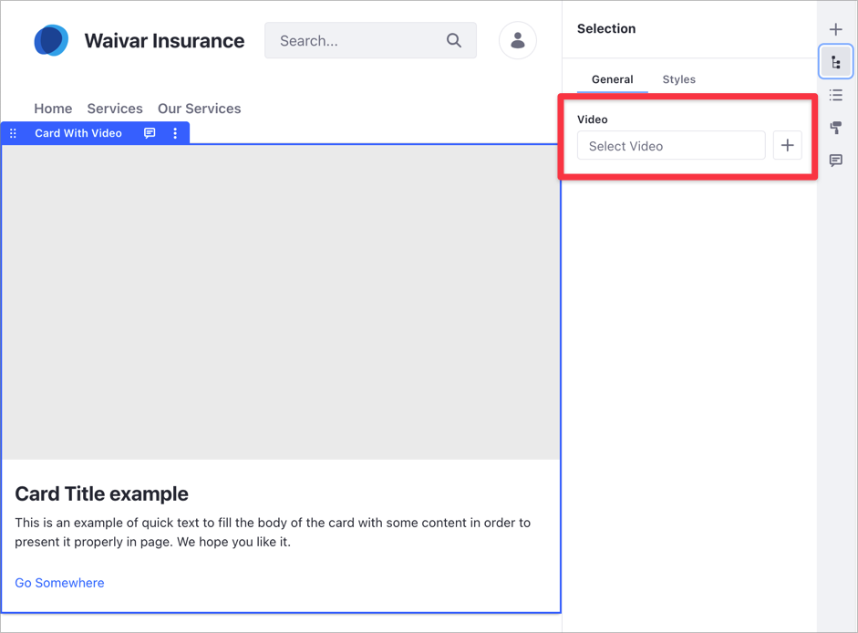
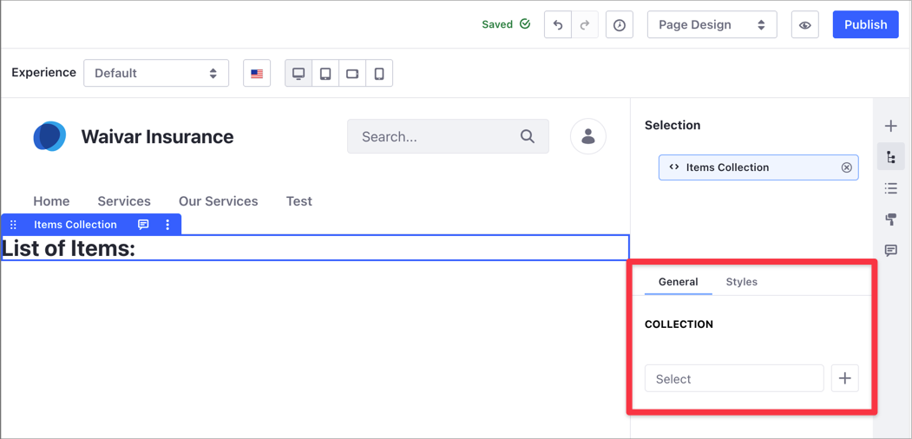

# Fragment Configuration Types Reference

This reference list the available configuration types for Fragments. See [Adding Configuration Options to Fragments](../../developing-page-fragments/adding-configuration-options-to-fragments.md) for more information on how to make a Fragment configurable.

These are the configurable Fragment types available to implement:

- `checkbox`
- `colorPalette`
- `itemSelector` (Available Liferay DXP 7.3+)
- `select`
- `text`
- `videoSelector` (Available Liferay DXP 7.4+)
- `collectionSelector` (Available Liferay DXP 7.3+)

```note::
  Configuration values inserted into the FreeMarker context honor the defined ``datatype`` value specified in the JSON file. For example, if the ``dataType`` is String, ``configuration.[name-value]?is_string`` is ``true``.
```

## Checkbox Configuration

This JSON configuration creates a checkbox you can implement for cases where a boolean value selection is necessary:

```json
{
    "fieldSets": [
        {
            "fields": [
                {
                    "name": "hideBody",
                    "label": "Hide Body",
                    "description": "hide-body",
                    "type": "checkbox",
                    "defaultValue": false
                }
                ...
            ]
        }
    ]
}
```


## Color Palette Configuration

This JSON configuration creates a color selector you can implement for cases where you must select a color:

```json
{
    "fieldSets": [
        {
            "fields": [
                {
                    "name": "textColor",
                    "label": "Text color",
                    "type": "colorPalette",
                    "dataType": "object",
                    "defaultValue": {
                        "cssClass": "white",
                        "rgbValue": "rgb(255,255,255)"
                    }
                }
                ...
            ]
        }
    ]
}
```

The `colorPalette` type stores an object with two values: `cssClass` and `rgbValue`.

For example, if you implement the snippet above, you can use it in the FreeMarker context like this:

```html
<h3 class="text-${configuration.textColor.cssClass}">Example</h3>
```

If you were to choose the color white, the `h3` tag heading would have the class `text-white'`.


## Item Selector Configuration

This configuration creates a selector that lets you select one existing piece of content (a web content article, blog entry, or document by default) to include in the Fragment.

```json
{
"fieldSets": [{
    "fields": [{
        "label": "select-content",
        "name": "itemSelector1",
        "type": "itemSelector",
        "typeOptions": {
            "enableSelectTemplate": true
        }
    }]
}]
}
```

You can provide a more advanced configuration that lets authors select only a specific type of content. The configuration below specifies that only web content articles can be selected. The optional `itemSubtype` property specifies that the selected web content article must use the structure `article-structure-key-15` to be selected:

```json
{
"fieldSets": [{
    "fields": [{
        "label": "select-content",
        "name": "itemSelector1",
        "type": "itemSelector",
        "typeOptions": {
    "itemType" : "com.liferay.journal.model.JournalArticle",
    "itemSubtype": "article-structure-key-15"
        }
    }]
}]
}
```

This example specifies that only a document with the `img` or `jpg` MIME type that uses the structure `metadataset-structure-key-2` can be selected:

```json
{
"fieldSets": [{
    "fields": [{
        "label": "select-content",
        "name": "itemSelector1",
        "type": "itemSelector",
        "typeOptions": {
    "itemType" : "com.liferay.portal.kernel.repository.model.FileEntry",
    "itemSubtype": "metadataset-structure-key-2",
    "mimeTypes": ["img/jpg"]
        }
    }]
}]
}
```

This example specifies that only blog entries can be selected:

```json
{
"fieldSets": [{
    "fields": [{
        "label": "select-content",
        "name": "itemSelector1",
        "type": "itemSelector",
        "typeOptions": {
    "itemType" : "com.liferay.blogs.model.BlogsEntry",
        }
    }]
}]
}
```

You can then render the content in your Fragment with this HTML snippet for the web content article:

```markup
<div class="fragment_name">
  [#if configuration.itemSelector1.content??]
       ${configuration.itemSelector1.content}
  [/#if]
</div>
```

You can also access the Java object in your Fragment, if you need access to specific portions of the content, under the key `[name-of-field]Object` (`itemSelector1Object` 
in the example below). This example renders the title, description, and body of the web content article:

```markup
<div class="fragment_name">
  [#if configuration.itemSelector1.content??]
    ${itemSelector1Object.getTitle()}
    ${itemSelector1Object.getDescription()}
    ${itemSelector1Object.getContent()}
  [/#if]
</div>
```


## Select Configuration

This JSON configuration creates a selector you can implement for cases where you must select a predefined option:

```json
{
    "fieldSets": [
        {
            "fields": [
                {
                    "name": "numberOfFeatures",
                    "label": "Number Of Features",
                    "description": "number-of-features",
                    "type": "select",
                    "dataType": "int",
                    "typeOptions": {
                        "validValues": [
                            {"value": "1"},
                            {"value": "2"},
                            {"value": "3"}
                        ]
                    },
                    "defaultValue": "3"
                }
                ...
            ]
        }
    ]
}
```


## Text Configuration

This JSON configuration creates an input text field you can implement for cases where you must manually input a text option:

```json
{
    "fieldSets": [
        {
            "fields": [
                {
                    "name": "buttonText",
                    "label": "Button Text",
                    "description": "button-text",
                    "type": "text",
                    "typeOptions": {
                        "placeholder": "Placeholder"
                    },
                    "dataType": "string",
                    "defaultValue": "Go Somewhere"
                }
                ...
            ]
        }
    ]
}
```


## Video Selector

> Available: Liferay 7.4+.

Using the `videoSelector` type, you can create a video selector to incorporate a [External Video](../../../creating-pages/building-and-managing-content-pages/page-fragments-user-interface-reference.md#external-video) Fragment in another Fragment.

```json
{
  "fieldSets": [
    {
      "fields": [
        {
          "label": "My Video Selector",
          "name": "myVideoConfig",
          "type": "videoSelector"
        }
      ]
    }
  ]
}
```

This is useful when you want a Fragment that has an embedded video by default. The following JSON configuration sample shows how to incorporate a External Video selector in a Card Fragment:

```json
{
"fieldSets": [
    {
        "fields": [
            {
                "label": "Video",
                "name": "video",
                "type": "videoSelector"
            }
        ]
    },
    {
        "configurationRole": "style",
        "fields": [
            {
                "dataType": "string",
                "defaultValue": "w-100",
                "label": "image-size",
                "name": "imageSize",
                "type": "select",
                "typeOptions": {
                    "validValues": [
                        {
                            "label": "fit",
                            "value": "w-100"
                        },
                        {
                            "label": "original-size",
                            "value": "w-0"
                        }
                    ]
                }
            }
        ]
    }
]
}
```



```note::
   The `videoSelector` type is compatible with the `External Video <../../../creating-pages/building-and-managing-content-pages/page-fragments-user-interface-reference.md#external-video>`_ Fragment, but not with the `Video URL <../../../creating-pages/building-and-managing-content-pages/page-fragments-user-interface-reference.md#video-url>`_ Fragment.
```

## Collection Configuration

> Available: Liferay DXP 7.4+.

Using the `collectionSelector` configuration type, you can develop a Fragment that includes a [Collection](../../../../content-authoring-and-management/collections-and-collection-pages/about-collections-and-collection-pages.md) or Collection Provider. You can use the `collectionSelector` with both Manual and Dynamic Collections.

```note::
   Collection Providers are a new feature in Liferay DXP 7.3 that allows developers to create specific collections with more advanced criteria. To learn more, read the information about `Creating an Information List Provider <https://help.liferay.com/hc/en-us/articles/360029067271-Creating-an-Information-List-Provider>`_ in the `Info Framework <https://help.liferay.com/hc/en-us/articles/360029067251-Introduction-to-The-Info-Framework>`_ developer documentation..
```

The following JSON configuration shows how to use the `collectionSelector`:

```json
{ 
    "fieldSets": [   
        {            
        "label": "Collection",            
        "fields": [                
            {                    
                "name": "collection",                    
                "type": "collectionSelector"                
            }            
        ]        
        } 
    ]
}
```

You can use this Fragment configuration with the following HTML code sample to list the Collection items. The `collectionObjectList` represents the Collection selected in the [Content Page editor](../../../creating-pages/building-and-managing-content-pages/content-page-editor-user-interface-reference.md). To reference this Collection in the HMTL, use the Collection `name` in the JSON configuration and the `ObjectList` suffix. In the previous JSON code excerpt, the Collection `name` is `collection` so the HTML references the Collection using `collectionObjectList`.

```html
<div class="fragment_310">
 <h1>
  List of Items:
 </h1>
  <ul>
  [#if collectionObjectList??]
   [#list collectionObjectList as item]
    <li>${item.title}</li>
   [/#list]
  [/#if]
  </ul>
</div>
```



You can further customize the Collection to select only a certain type of assets in the Collection. For example, if your Collection includes Web Content and Blogs, you can restrict the `collectionSelector` configuration to select only Blog entries using the `itemType`:

```json
{ 
 "fieldSets": [   
  {            
   "label": "Collection",            
   "fields": [                
    {                    
     "name": "collection",                    
     "type": "collectionSelector",
     "typeOptions": {
      "itemType": "com.liferay.blogs.model.BlogsEntry"
               }
    }            
   ]        
  } 
 ]
}
```

```tip::
   In addition to the `itemTime`, you can specify the `itemSubtype` in the configuration. The `itemSubtype` corresponds to the Asset `classPK`.
```

## Additional Information

- [Developing Fragments](../developing-page-fragments/developing-fragments-intro.md)
- [Fragment Specific Tags Reference](./fragment-specific-tags-reference.md)
- [Page Fragment Editor Interface Reference](./page-fragment-editor-interface-reference.md)
