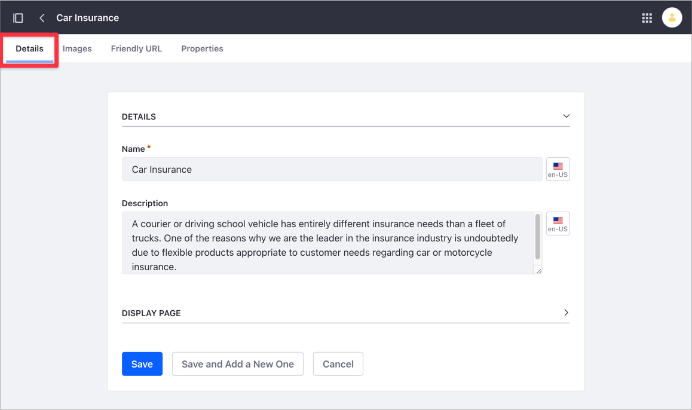
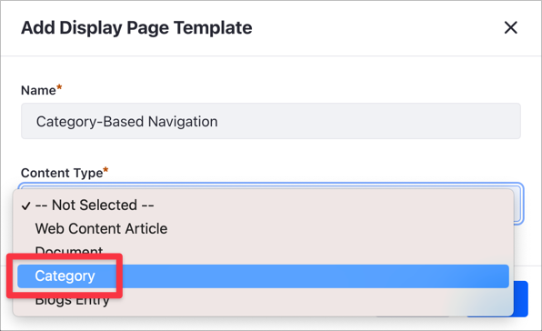
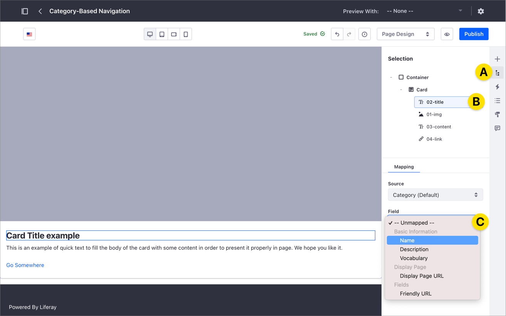
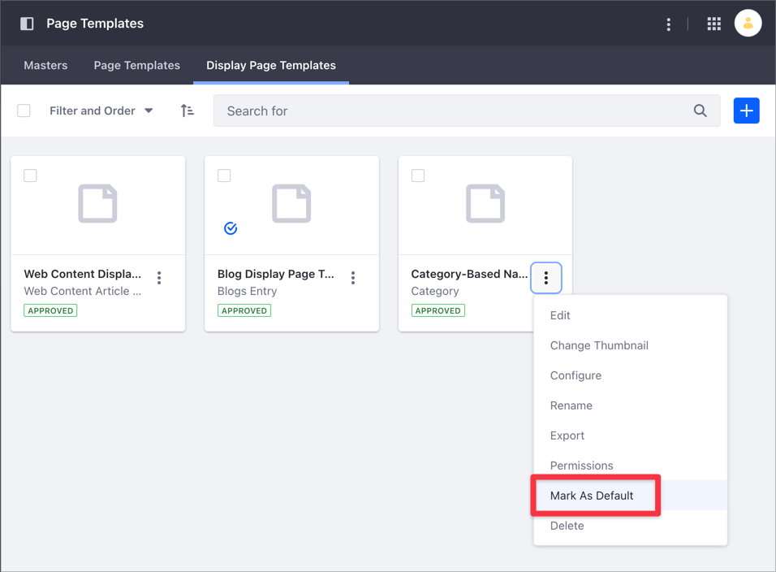
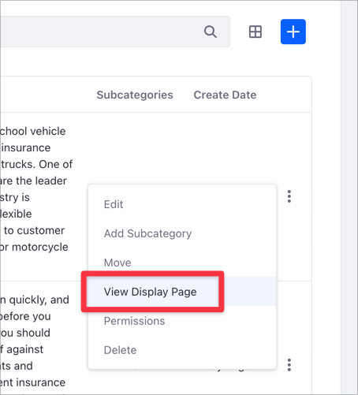
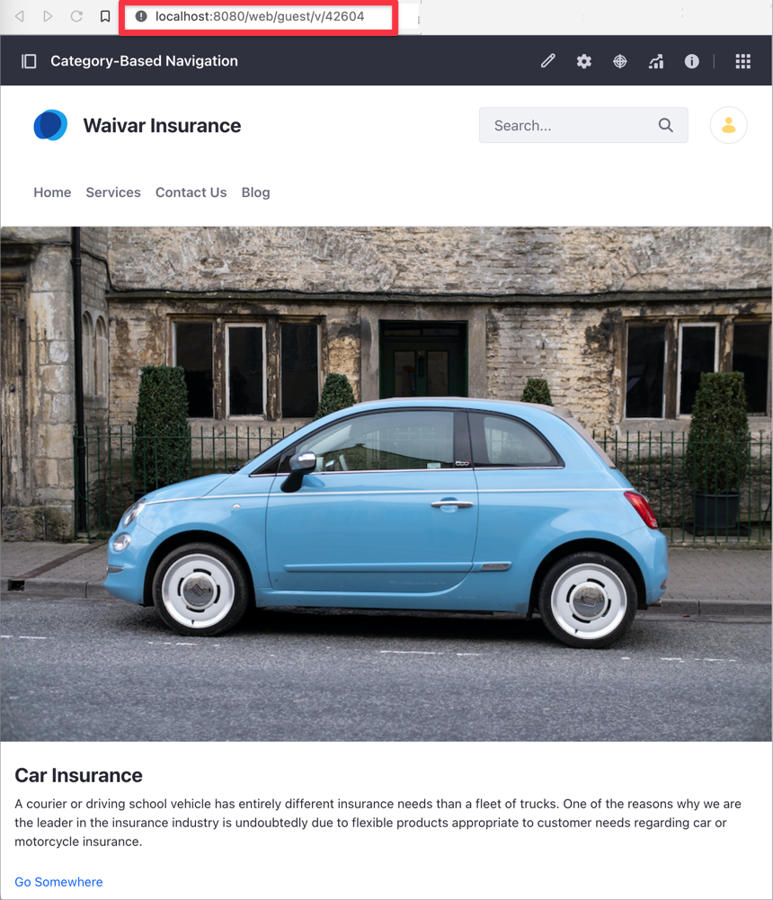

# Displaying Categories using Display Pages

> Available: Liferay DXP 7.4+.

Using a [Display Page Template](../../site-building/displaying-content/using-display-page-templates/displaying-content-with-display-page-templates.md) you can display Web Content, Documents, and Blog Entries in a [Display Page](../../site-building/displaying-content/using-display-page-templates/publishing-content-with-display-pages.md). Starting with Liferay DXP 7.4, you can also create a Display Page Template to show Categories on a Display Page. This can be useful if your company sells multiple products or services that you [organize using Categories](../tags-and-categories/organizing-content-with-categories-and-tags.md). Because Display Pages are ideal to show a catalog of elements in a consistent way, you can use Category-based Display Pages to provide users a consistent experience when browsing your catalog.


## Assigning Categories to Display Pages


The steps to display your Categories on a Display Page are:

1. [Create and edit the Categories you want to display](#step-1-creating-and-editing-the-categories).
1. [Create the Display Page Template](#step-2-creating-the-display-page-template).
1. [Map the Category Fields in the Display Page](#step-3-mapping-the-category-fields-in-the-display-page).

## Example: Using Category-Based Navigation on a Display Page

This step-by-step example shows you how to use Categories in combination with a Display Pages Template to present the service of a fictional insurance company.

### Step 1: Creating and Editing the Categories

Create the Categories if they do not exist yet, and edit them to include the information you want to map on the Display Page. This example creates two new Categories with a description and a picture, each Category corresponding to different insurance services.

1. [Create a new Category](./defining-categories-and-vocabularies-for-content.md#defininig-categories) named *Car Insurance*.
1. In the Categories application, click the *Actions* () menu for your new category and select *Edit*.
1. Click the *Details* tab and add a *Description* of this Category.

    

1. Click the *Images* tab and add an image for the Category using the *Add Image* () button.
1. Click again on the *Details* tab and then click *Save*.

### Step 2: Creating the Display Page Template

Starting with Liferay DXP 7.4, the Display Page Template includes a new option to use Categories as the Content Type.

1. Go to *Site Administration* &rarr; *Design* &rarr; *Page Templates*.
1. Click *Display Page Templates* and click the *Add* () button.
1. Select the Master Page Template you want to use for this Display Page Template.

    ```tip::
       Every Page or Page Template requires a Master Page Template. To learn more, read `Master Page Templates <../../site-building/creating-pages/defining-headers-and-footers/master-page-templates.md>`_.
    ```

1. Enter the *Name* of your Display Page Template and in the *Content Type* drop-down menu, select *Category*.

    

1. Click *Save*.

### Step 3: Mapping the Category Fields in the Display Page

After you create the Display Page Template, you can edit the components and layout of your template.

```tip::
   The Display Page Template editor works like the Content Page Editor. See `Configuring Elements on Content Pages <../site-building/creating-pages/building-and-managing-content-pages/configuring-elements-on-content-pages.md>`_ for more information.
```

This example shows how to map the Category fields using a [Card Fragment](../../site-building/creating-pages/building-and-managing-content-pages/page-fragments-user-interface-reference.md).

1. Drag and drop a Container Fragment to the default drop zone.
1. On top of the Container Fragment, drag and drop a new Card Fragment.
1. Click on the *Selection* menu (A) and then click the Card's title (B) to open the mapping options.
1. In the *Mapping* area and the *Source* drop-down menu, select *Category* if it's not selected already.
1. Click the *Field* drop-down menu and select *Name* (C) to map your Category's name to the Card's title.

    

1. Repeat the same mapping process for the Card description and Card image. This list summarizes the Card Fragment to Category Field mapping in the example:

    - Title &rarr; Name
    - Content &rarr; Description
    - Image &rarr; Main Image

1. Click *Publish*.
1. Under the *Display Page Templates* list, click the *Actions* () menu for the new Display Page Template and choose *Mark as Default*.

    

1. Go to *Site Administration* &rarr; *Categorization* &rarr; *Categories*.
1. Click the Vocabulary with the Categories from [Step 1](#step-1-creating-and-editing-the-categories).
1. On any Category, click the *Actions* () menu and select *View Display Page*.

    

The Display Page uses the mappings in the Display Page Template to show the Category fields. The Display Page URL is unique for the selected Category.



## Related Information

- [Organizing Content with Categories and Tags](./organizing-content-with-categories-and-tags.md)
- [Tagging Content and Managing Tags](./tagging-content-and-managing-tags.md)
- [Master Page Templates](../../site-building/creating-pages/defining-headers-and-footers/master-page-templates.md)
