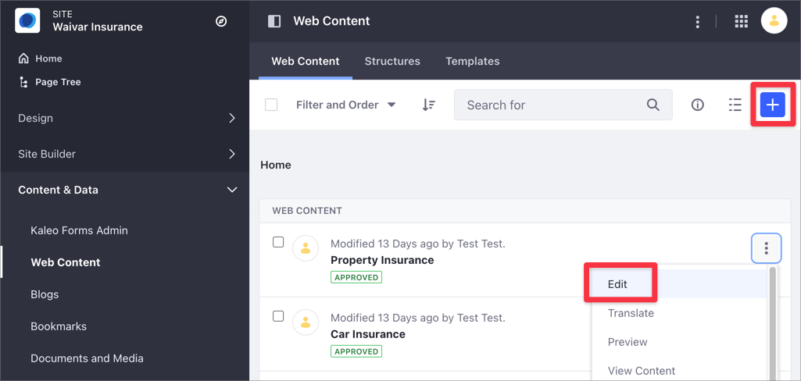
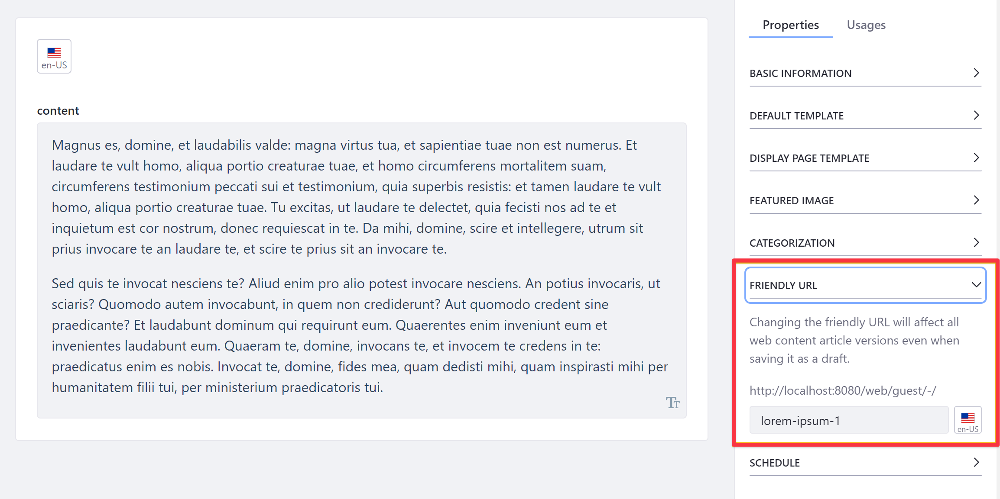
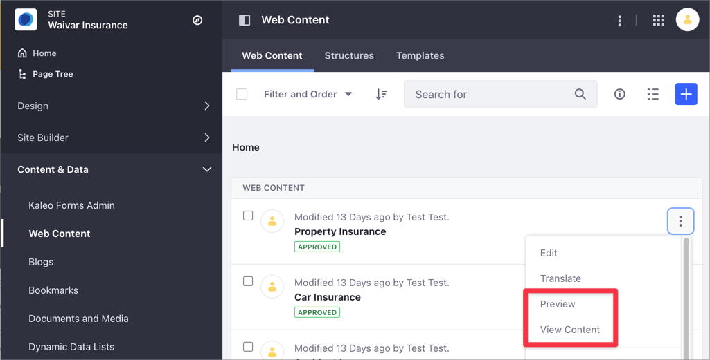

# Publishing Content With Display Pages

To create a Display Page, create a Display Page Template first and then display the content using the Display Page unique URL. Display Pages are always associated to a certain type of content. To learn more about Display Page Templates and Display Pages, read [Displaying Content with Display Page Templates](./about-display-page-templates-and-display-pages.md).

To publish your content using a Display Page:

1. From the Site Administration panel, select the panel category for the type of content you want to display:

    - For *Web Content*, *Blogs*, or *Documents and Media*, click *Content & Data*.
    - For *Categories*, click *Categorization*

    ```note::
       Publishing Categories using a Display Page Template is available starting with Liferay DXP 7.4.
    ```

1. From the *Actions* () menu, *Edit* an existing content. Alternatively, click the *Add* () button to create a new piece of content.

    

1. Expand the *Display Page Template* section in the Properties window, open the drop down selector and choose *Specific Display Page Template*.

    

1. Click the *Select* button, select the Display Page Template, and click *Done*.

    ```note::
       You can preview what the display page looks like with the *Preview* button located next to the selected Display Page Template.
    ```

1. Scroll down to the *Friendly URL* panel, expand it, and modify the friendly URL if you want. This is the URL the Display Page uses to show your content.

    

1. Click on *Publish*.
1. To preview your content in the context of the Display Page Template, click the *Actions* () menu and choose *Preview*. To view your Display Page, including the friendly URL, choose *View Content*.

    

## Additional Information

- [About Display Page Templates and Display Pages](./about-display-page-templates-and-display-pages.md)
- [Creating and Managing Display Page Templates](./creating-and-managing-display-page-templates.md)
