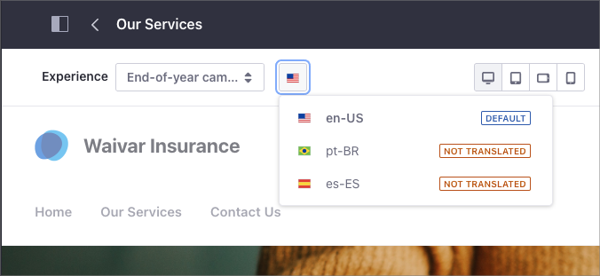

# Content Page Personalization

You can tailor your Content Page to different groups of users, providing each group a personalized experience rather than a generic one. You can also [translate the Experience](#managing-experience-localization) to different languages or leverage Content Page personalization to [conduct A/B Testing](#content-page-experiences-and-a-b-testing).

Personalizing your Content Page for different users is a two-step process:

1. [Define a Segment](../segmentation/creating-and-managing-user-segments.md) for the users you want to provide a personalized experience.
2. [Create a Experience](./creating-and-managing-experiences.md) with customized content for your Segment.

## Understanding How Experiences Work

> Some Experiences functionality is available in Liferay 7.4+, 7.3 Fix Pack 1+, and 7.2 Fix Pack 11+ only.

You can create multiple experiences for the same Content Page, each Experience covering a particular need. For example, you can create different experiences for users who log in to your Site and for users who browse the Site anonymously. Each Experience contains the content and layout that is most appropriate for each Segment.

Consider the following information when you create multiple experiences for the same Content Page:

- Every Content Page includes a *Default* experience. When you create a new Experience, *Default* is used as a template.
- You can modify the Default experience, but existing experiences based on Default don't change.
- You can duplicate any experience except Default.
- You can reorder Experiences in the selection dialog using the Up () and Down () controls.
- When you have multiple experiences on the same Content Page, their order determines their precedence:
  
  - Experiences at the top of the list take precedence over the ones below.
  - When a user meets the criteria for more than one Experience, the Experience listed first is the active one.
  - An Experience is inactive when placed below an experience targeted to the *Anyone* Segment.
  - New Experiences are listed below the *Default* experience and inactive by default.
  
  ```tip::
    When multiple Experiences target the same Segment, Liferay DXP shows the active one next to the Experience's name.
  ```

To better understand how the Experiences' precedence works, consider this example of a Content Page with four custom Experiences:

- *Anonymous User* and *Anonymous User Promotions*, which apply to the non-authenticated user Segment.
- *Authenticated User*: Applies to the *Authenticated User* Segment.
- *No Customization*: Applies to the *Anyone* Segment.

  

In this example:

- A non-authenticated user sees the *Anonymous User* Experience (the one with the *Active* label). This user doesn't see the *Anonymous User Promotions* Experience because it appears below *Anonymous User*.
- Authenticated users don't see the *Authenticated user* Experience, because the *No customization* Experience applies to the *Anyone* Segment and it's listed first.
- Anyone not in the *Anonymous User* or *Authenticated User* Segments sees the *No customization* Experience because it targets *Anyone*.

## Managing Experience Localization

> Available: Liferay 7.4+.

When you create a new Experience, you define its target language(s), along with a default. By selecting additional languages and [translating the Page content](../../../content-authoring-and-management/web-content/translating-web-content/manually-translating-web-content.md), you provide Experiences in users' own languages. For example, if the user language is configured as es-ES and users visit a Content Page with an Experience targeted to the user's Segment and localized to es-ES, the language they see is es-ES.

  ```note::
     Liferay DXP uses the user-configured language for authenticated users and, by default, the default Portal language for anonymous users.
  ```

You can configure the Experience using the languages available for your Site. To change the available Site languages, see [Site Localization](../../site-settings/site-localization.md).


```note::
   When a user visits a Page and there is an Experience targeted to the user's Segment but not localized into the user's language, the user sees the Experience in the default language.
```

You can add or remove languages from the Experience using the [Edit Experience](./creating-and-managing-experiences.md#managing-content-page-experiences) () button, except for the default language that is always selected. The language selector button for the Experience only shows the languages configured for that particular Experience.

  

## Content Page Experiences and A/B Testing

When you [create an A/B Test](../../optimizing-sites/ab-testing/creating-ab-tests.md) in Liferay DXP, you choose an Experience for the test. This Experience can be the Default one or any other you have created.

To avoid changes in the Experience that can interfere with the A/B Test results, you cannot edit an Experience that is part of a running A/B Test. In this situation, the Experience shows a locker icon () next to its name.

For more information about A/B Testing in Liferay DXP and Liferay Analytics, see [A/B Testing](../../optimizing-sites/ab-testing/ab-testing.md).

## Related Information

- [Creating and Managing Experiences](./creating-and-managing-experiences.md)
- [Personalizing Collections](./personalizing-collections.md)
- [Getting Analytics for User Segments](../segmentation/getting-analytics-for-user-segments.md)
- [Creating and Managing User Segments](../segmentation/creating-and-managing-user-segments.md)
